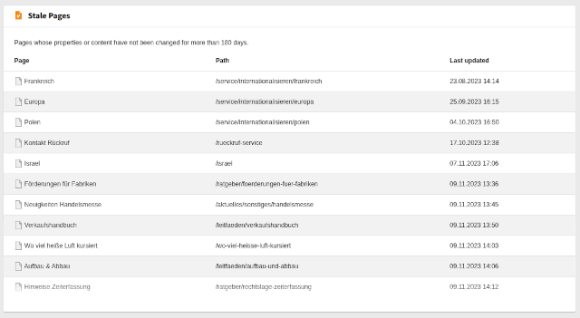

# TYPO3 Content Audit Dashboard Widget `xima_typo3_content_audit`

[](https://packagist.org/packages/xima/xima-typo3-content-audit)
[](https://extensions.typo3.org/extension/xima_typo3_content_audit)
[](https://extensions.typo3.org/extension/xima_typo3_content_audit)

A widget for the TYPO3 dashboard to evaluate the relevance, accuracy and freshness of your digital content



## Features

Available widgets:

- Stale Pages: Displays a list of pages that have not been changed for a long time
  - Integrators may exclude certain pages from the list, e.g. start page or landing pages
- Fresh Pages: Displays a list of pages that have been changed recently
- Long Hidden Pages: Display a list of pages that have been hidden for a long time and may no longer be relevant
- Long-hidden Content: Display a list of content that has been hidden for a long time and may no longer be relevant
- Images with missing fields: Lists images that are missing important metadata such as alternative text
  - The field may be configured, e.g. to check for missing copyright information instead of alternative text
- Broken Links: Display pages with broken internal links detected by the TYPO3 linkvalidator
  - **Note:** Requires the `typo3/cms-linkvalidator` extension to be installed and configured
- Daily Content Mission: Shows daily motivational messages to encourage editors to improve content quality
  - Messages rotate by day of week and reference specific widgets to check

✨ Would you like to share important news and announcements with your editorial team
or add a general welcome message for editors on the dashboard? Check out our
[dashboard news extension](https://github.com/xima-media/xima-typo3-dashboard-news).

## Requirements

- PHP
- TYPO3

## Installation

``` bash
composer require xima/xima-typo3-content-audit
```

## Source

https://github.com/xima-media/xima-typo3-content-audit

## Usage

- Add widgets to your dashboard manually
- Check the result lists and decide what to do with the shown pages - update the content,
  archive or delete the page

## Configuration

### Dashboard Preset

The extension provides a preset which includes all widgets at once,
without the need to add them manually one by one.

- Available in the dashboard creation wizard
- Can be set as default for new users via TSconfig:
  ```
  options.dashboard.dashboardPresetsForNewUsers = tx_ximatypo3contentaudit_dashboard
  ```

### Widget Configuration

You may configure the widgets by adjusting the available parameters.
Copy and paste the `parameters` section from the
[Services.yaml](./Configuration/Services.yaml) file into your own
and adjust the values as needed.

_EXT:acme_sitepackage/Configuration/Services.yaml_
```yaml
parameters:
  xima_typo3_content_audit.widgets.stale_pages.options:
    refreshAvailable: true
    excludePageUids: [4,8,15,16,23,42]
```

### Adding Multiple Widgets of the Same Type

TYPO3 is not able to let editors add multiple widgets of the same type
to their dashboard.
If you want to add multiple widgets with only different configurations,
you need to create multiple service definitions with different
key-names and `identifier` fields.

Example: A second widget showing images with empty copyright fields,
additionally to the existing one showing images with missing alternative texts.
[Copy and rename the parameter section & widget definition](./Configuration/Services.yaml)
into your sitepackage (eg. `acme_sitepackage`).

_EXT:acme_sitepackage/Configuration/Services.yaml_
```yaml
parameters:
  acme_sitepackage.widgets.missing_image_fields.options: # add your own parameter key, see below
    refreshAvailable: true
    missingField: 'copyright'

  Acme\AcmeSitepackage\Widgets\MissingImageFields: # change this key to avoid conflicts
    class: 'Xima\XimaTypo3ContentAudit\Widgets\MissingImageFields'
    arguments:
      $dataProvider: '@Xima\XimaTypo3ContentAudit\Widgets\Provider\MissingImageFieldsDataProvider'
      $options: '%acme_sitepackage.widgets.missing_image_fields.options%' # use your own parameter here
    tags:
      - name: dashboard.widget
        identifier: 'acmeSitepackageMissingImageFields' # change this identifier to avoid conflicts
        groupNames: 'content'
        title: 'LLL:EXT:xima_wfs_sitepackage/Resources/Private/Language/locallang.xlf:widgets.missing_image_fields.title' # use your own language label here
        description: 'LLL:EXT:xima_typo3_content_audit/Resources/Private/Language/locallang.xlf:widgets.missing_image_fields.description'
        iconIdentifier: 'content-audit-widgets-hidden-content'
        height: 'medium'
        width: 'medium'
```

## Development

To set up a development environment, please clone the repository and run

```bash
ddev start && ddev init-typo3
```

Execute the command again to reset the installation.

## License

GNU General Public License version 2 or later

The GNU General Public License can be found at http://www.gnu.org/copyleft/gpl.html.

## Author

Dan Kleine ([@pixelbrackets](https://pixelbrackets.de)) for [XIMA](https://www.xima.de/)

## Changelog

[CHANGELOG.md](CHANGELOG.md)
